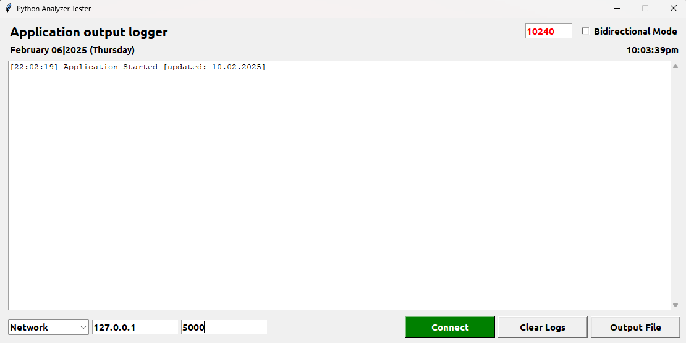
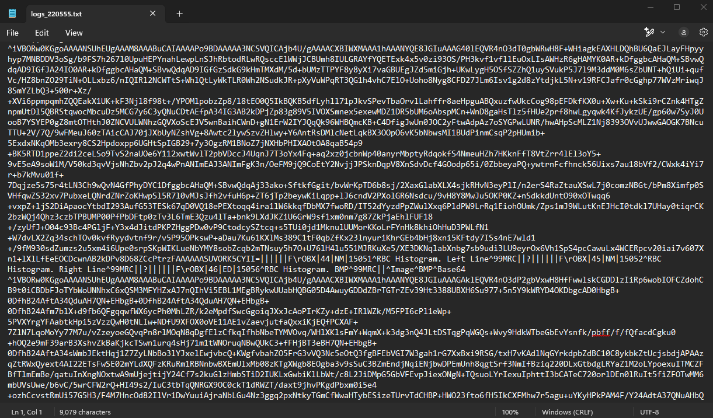
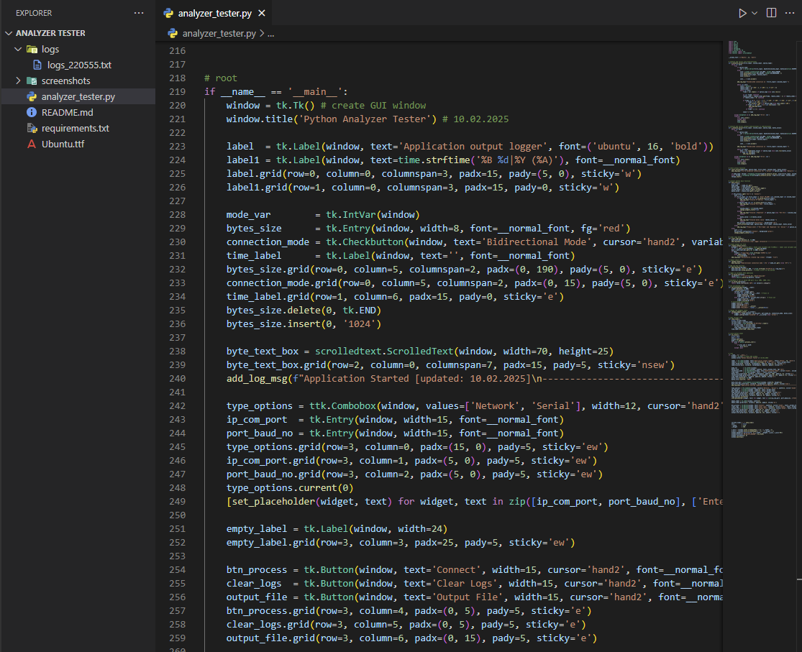

# Python Analyzer Tester using Python3 Tkinter

### **A Python gui-based _medical analyzer tester_ using Tkinter GUI**

[Tkinter](https://en.wikipedia.org/wiki/Tkinter) is a Python binding to the Tk GUI toolkit. It is the standard Python interface to the Tk GUI toolkit, and is Python's defacto standard GUI.

<br/>

**Pathology analyzer communication tester supporting serial and network protocols with simulates and tests data exchange (ASTM/HL7) with host system.**


## Task Description

A project to build a Python-based medical analyzer tester for continuously receive analyzer data. Here analyzer tester communicate with any medical analyzer base on ip address with port no for network communication or com port with baudrate for serial communication with bytes size and connection mode. analyzer tester continuously try to create unidirectional or bidirectional connection with bytes size if connect then receive data and show into the terminal and you can write that data into [TXT](https://en.wikipedia.org/wiki/Text_file) file. Here are some special features added.

* **Running time clock**
* **Bidirectional/Unidirectional mode**
* **Generate txt file**

## Project Requirements & Testing Environments
This project was developed using the latest operating systems, software, and tools.

* **Operating System :** Windows11
* **Software :** Python3.12, Visual Studio Code


## Installation

First [Download](https://www.python.org/downloads/), install and configure [Python](https://www.python.org/doc/). Then use the package manager [pip](https://pip.pypa.io/en/stable/) to install on.

* Windows installation
* Linux installation
---


## Notes
For better font interface install `Ubuntu.ttf` font and that is into the file folder and also the `requirements.txt` file, lists of all the python libraries that my "**_Python Analyzer Tester_**" depends on and installs those packages from the file:

```bash
pip install -r requirements.txt
# or
sudo pip install -r requirements.txt
```


## Sreenshots
Here are some screenshots of the `Analyzer Tester` project:

**Application**<br/>
<br/>
**Main Window**<br/>
<br/>
**Data Received**<br/>
<br/>
**Text File Data**<br/>
<br/>
**Code Snapshot**<br/>



## Contributing

Contributions, suggestions, and feedback are always welcome! ❤️
To contribute:

1. Fork the repository
1. Create a new branch (`feature/new-feature`)
1. Commit your changes
1. Push and submit a Pull Request

💬 You can also open an issue if you’d like to discuss a feature or report a bug.


## For more or connect with me

<p align='center'>
  <a href="https://github.com/iamx-ariful-islam"></a>&nbsp;&nbsp;
  <a href="https://bd.linkedin.com/in/iamx-ariful-islam"></a>&nbsp;&nbsp;
  <a href="https://x.com/mx_ariful_islam"></a>&nbsp;&nbsp;
  <a href="https://www.facebook.com/iamx.ariful.islam/"></a>
</p>


## License

The [MIT](https://choosealicense.com/licenses/mit/) License (MIT)


## 💖 Thank You for Visiting!

> “Good design is about making things simple yet significant”  
> — *Md. Ariful Islam*
